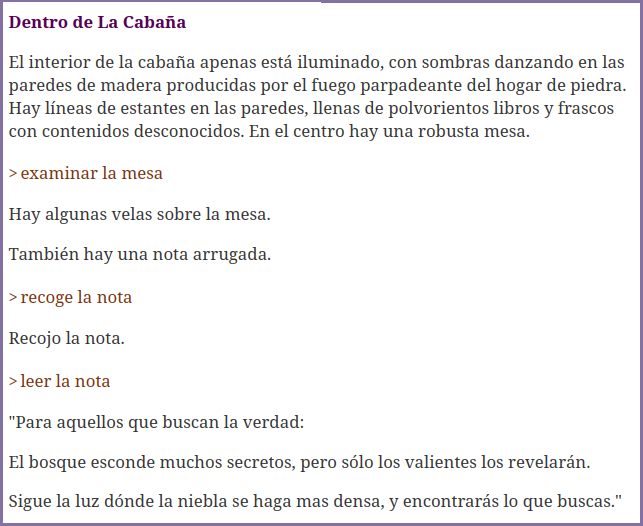
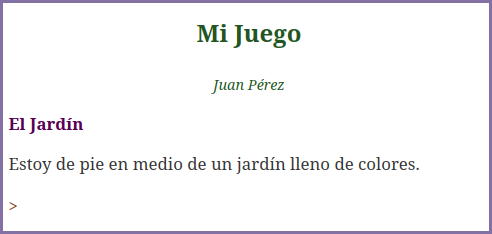

# Dragonfly
*Motor de Ficción Interactiva en Javascript*

*Versión actual: 0.1.1*

[English](./README.md "Dragonfly README in English") | Español

## ¿Qué es Dragonfly?

Dragonfly es un motor de juegos de ficción interactiva. Permite crear y jugar aventuras de conversacionales directamente en el navegador.

## Filosofía

- **Desarrollo sencillo**. Para ello, Dragonfly utiliza **DFML**: un lenguaje simple y fácil de entender (el uso de JavaScript es prácticamente innecesario).

- **Sin compilación, sin motores, sin máquinas virtuales**. Se ejecuta directamente en el navegador. No necesitas ningún programa especial para ejecutar tu juego. Puedes integrarlo fácilmente en cualquier sitio web.

---



**Puedes encontrar algunos ejemplos en el directorio `samples`.**

---

## Configuración del proyecto

La estructura inicial del proyecto es:

```sh
index.html
mygame.js
mygame.dfml
```

## Ejemplo del archivo "index.html":

```html
<!DOCTYPE html>
<html lang="es">
<head>
   <meta charset="UTF-8">
   <meta name="viewport" content="width=device-width, initial-scale=1.0">
   <title>Mi Juego</title>
</head>
<body>
   <div id="game-area"></div>
   <script type="module" src="mygame.js"></script>
</body>
</html>
```

## Ejemplo del archivo "mygame.js":

```javascript
import { Book } from "https://jason80.github.io/dragonfly/base/book.js"

window.onload = function() {
   const book = new Book("game-area", "mygame.dfml");

   book.run();
}
```

## Ejemplo del archivo "mygame.dfml":

```dfml
# Nodo del libro (cabecera del libro):
book(title: "Mi Juego", author: "Juan Pérez") {

   # Indica a Dragonfly quién es el jugador:
   property(name: "player", value: "-player")

   # Incluye un diccionario predefinido:
   include(src: "https://jason80.github.io/dragonfly/templates/dict-es.dfml")
}

# Todos los objetos (sustantivos) se definen en el nodo dictionary:
dictionary {
   # Definición de un jardín:
   noun(names: "El Jardín, jardín") {
      describe-place {
         "Estoy de pie en medio de un jardín lleno de colores."
      }

      # Definición del jugador:
      noun(names: "Vincent, jugador, -player") {
         describe-object {
            "Un aventurero, listo para explorar el mundo que me rodea."
         }
      }
   }
}
```

---

## Ejecutar el juego:

Ejecuta el juego en tu navegador usando un servidor local:

### Usando Python3:

En tu terminal, introduce:

```sh
python3 -m http.server
```

Copia la URL indicada y ábrela en tu navegador.

### Usando VSCode:

Abre la carpeta del proyecto y ejecuta el comando Run with Live Server
(instala la extensión Live Server si es necesario).



## Tutoriales:
[English](./tutorial/en/start.md "Tutorial in English") | [Español](./tutorial/es/start.md "Tutorial en español")
