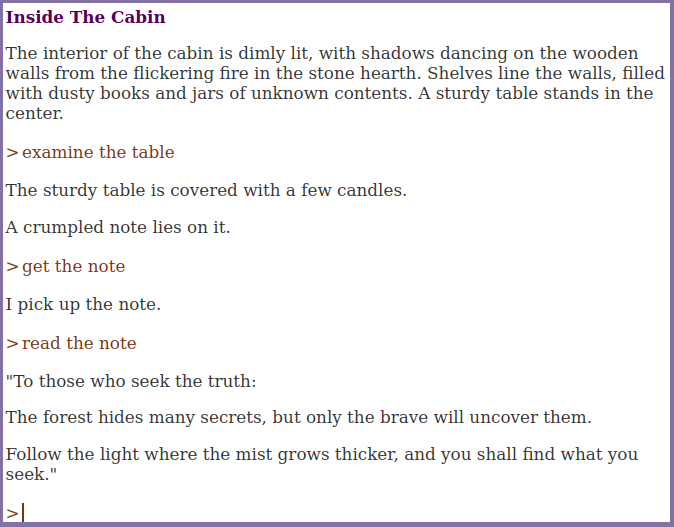
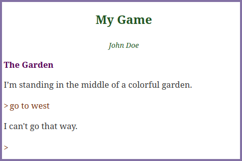

*Current version: 0.5.0*

English | [Español](./README.es.md)

## What is Dragonfly?

Dragonfly is an interactive fiction game engine. It allows you to create and play interactive fiction games in your browser.

## Philosophy

- **Simple development**. For this, Dragonfly uses **DFML**: a simple and easy-to-understand language (JavaScript is practically not required).

- **No compilation, no engines, no virtual machines**. It runs directly in the browser. You don’t need any special program to run your game. You can easily place it on any website.

---



---

## Sample Games

| Game | Description | Topics Covered
|---|---|---|
| [The Forest](https://jason80.github.io/dragonfly/samples/en/forest/forest.html "The Forest") | Simple example with five locations | Basics: Movement, attributes, containers, ending |
| [Chooser](https://jason80.github.io/dragonfly/samples/en/chooser/chooser.html) | Object dialog test | Basics: Dialog, objects, containers, inventory |

---

## Setting up the project

The initial project structure is:

```sh
index.html
mygame.js
mygame.dfml
```

## File "index.html" example:

```html
<!DOCTYPE html>
<html lang="en">
<head>
   <meta charset="UTF-8">
   <meta name="viewport" content="width=device-width, initial-scale=1.0">
   <title>My Game</title>
</head>
<body>
   <div id="game-area"></div>
   <script type="module" src="mygame.js"></script>
</body>
</html>
```

## File "mygame.js" example:

```javascript
import { Book } from "https://jason80.github.io/dragonfly/base/book.js"

window.onload = function() {
   const book = new Book("game-area", "mygame.dfml");

   book.run();
}
```

## File "mygame.dfml" example:

```dfml
# The book node (header's book):
book(title: "My Game", author: "John Doe") {

   # Tell Dragonfly who the player is:
   property(name: "player", value: "-player")

   # Include a pre-defined dictionary (first person):
   include(src: "https://jason80.github.io/dragonfly/templates/dict-en1.dfml")
}

# All objects (nouns) are defined in the dictionary node:
dictionary {
   # Define a garden:
   noun(names: "The Garden, garden") {
      describe-place {
         "I’m standing in the middle of a colorful garden."
      }

      # Define a player:
      noun(names: "Vincent, player, -player")
   }
}
```

---

## Run the game

Run the game in your browser using a local server:

### Using Python3:

On your terminal, run:

```sh
python3 -m http.server
```

Copy the requested URL and open it in your browser.

### Using VSCode:

Open the project folder and run the command `Run with Live Server`
(Install the Live Server extension if needed).



## Download Dragonfly

You can clone the project using git as follows:

```sh
git clone --recurse-submodules https://github.com/jason80/dragonfly mygame
```

The `--recurse-submodules` parameter is used to download the `dfml` module, which Dragonfly depends on.

## Tutorials:
[English](./tutorial/en/start.md) | [Español](./tutorial/es/start.md)

#### More documentation:
* [Doors](./tutorial/en/doors.md) | [Puertas](./tutorial/es/doors.md)

* [Darkness](./tutorial/en/darkness.md) | [Oscuridad](./tutorial/es/darkness.md)

* [Ambient sounds (Sequences)](./tutorial/en/sequences.md) | [Sonidos ambientales (Secuencias)](./tutorial/es/sequences.md)

* [Debug](./tutorial/en/debug.md) | [Depuración](./tutorial/es/debug.md)

* [Actions table](./tutorial/en/actions_table.md) | [Tabla de acciones](./tutorial/es/actions_table.md)

* [Responses table](./tutorial/en/responses_table.md) | [Tabla de respuestas](./tutorial/es/responses_table.md)

* [Conditions table](./tutorial/en/conditions_table.md) | [Tabla de condiciones](./tutorial/es/conditions_table.md)
