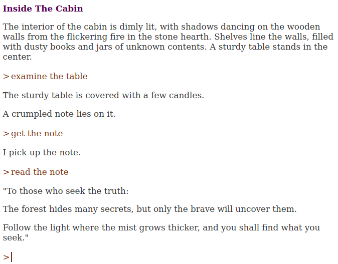

# Dragonfly
*Interactive Fiction Game Engine in Javascript*

*Current version: 0.1.0*

English | [Español](./README.es.md "Dragonfly README in Spanish")

## What is Dragonfly?

Dragonfly is an interactive fiction game engine. It allows you to create and play interactive fiction games in your browser.

## Philosophy

- **Simple development**. For this, Dragonfly uses **DFML**: a simple and easy-to-understand language (JavaScript is practically not required).

- **No compilation, no engines, no virtual machines**. It runs directly in the browser. You don’t need any special program to run your game. You can easily place it on any website.

---



**You can find some examples in the `samples` directory.**

---

## Setting up the project

The initial project structure is:

```sh
index.html
mygame.js
mygame.dfml
```

## File "index.html" example:

```html
<!DOCTYPE html>
<html lang="en">
<head>
   <meta charset="UTF-8">
   <meta name="viewport" content="width=device-width, initial-scale=1.0">
   <title>My Game</title>
</head>
<body>
   <div id="game-area"></div>
   <script type="module" src="mygame.js"></script>
</body>
</html>
```

## File "mygame.js" example:

```javascript
import { Book } from "https://jason80.github.io/dragonfly/base/book.js"

window.onload = function() {
   const book = new Book("game-area", "mygame.dfml");

   book.run();
}
```

## File "mygame.dfml" example:

```dfml
# The book node (header's book):
book(title: "My Game", author: "John Doe") {

   # Tell to Dragonfly who is the player:
   property(name: "player", value: "-player")

   # Include a pre-defined dictionary:
   include(src: "https://jason80.github.io/dragonfly/templates/dict-en.dfml")
}

# All objects (nouns) are defined in the dictionary node:
dictionary {
   # Define a garden:
   noun(names: "The Garden, garden") {
      describe-place {
         "I’m standing in the middle of a colorful garden."
      }

      # Define a player:
      noun(names: "Vincent, player, -player") {
         describe-object {
            "An adventurer, ready to explore the world around me."
         }
      }
   }
}
```

---

## Run the game

Runs the game in your browser at server:

### Using Python3:

On your terminal, run:

```sh
python3 -m http.server
```

Copy the requested URL and open it in your browser.

### Using VSCode:

Open the project folder and run the command `Run with Live Server`
(Install the Live Server extension if needed).


## Tutorials:
[English](./tutorial/en/start.md "Tutorial in English") | [Español](./tutorial/es/start.md "Tutorial en español")
