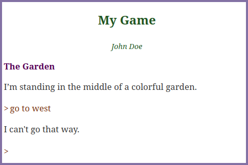

# Tutorial de Dragonfly en español

[English](../en/start.md "Tutorial in English") | Español

## Comenzando

Dragonfly es un motor para el desarrollo de juegos de texto interactivo o, conocidos tambien como Aventuras Conversacionales. Son juegos que se componen en su totalidad de texto (a veces imágenes y sonidos) y en ellos, el jugador podrá interactuar con la historia modificando su entorno.

## El libro

### Corriendo el juego:

Teniendo preparados los archivos necesarios como se explica en el README principal, podrás correr el index.html en un navegador mediante un servidor. Existen múltiples maneras, aquí van dos:

* Utilizando Visual Studio Code: luego de instalar el pluggin Live Server, le das click secundario a index.html y eliges: "Open with Live Server". Se abrirá tu navegador predeterminado con tu juego corriendo.
* Con el servidor de Python 3: Teniendo instalado Python 3, navega con un terminal hasta el directorio de tu juego y ejecuta: `python3 -m http.server`

Si todo va bien, tendrás el siguiente resultado:



### Primer archivo DFML (El jugador, su lugar y algunas cosas mas):

Luego de cambiar el título y el autor del libro, lo siguiente es decirle a Dragonfly quién es el jugador y dónde se encuentra. De paso podemos incluir el diccionario en español para no tener que definir los verbos, artículos, etc. de nuestro juego.

```
book(title: "Tutorial de Dragonfly", author: "Juan Perez") {

    # El jugador:
    property(name: "player", value: "-player")

    # El diccionario en español:
    include(src: "https://jason80.github.io/dragonfly/templates/dict-es.dfml")
}

# Los objetos se definen dentro del nodo 'dictionary':
dictionary {
   # Define el jardin (lugar):
   noun(names: "El Jardin, jardin") {
      describe-place {
         "Estoy parado en el medio de un colorido jardin. Mientras sus flores bañan el ambiente de perfume, el agua de una fuente produce un agradable sonido. Hay un banco de piedra en el medio del camino."
      }

      # Define al jugador dentro del jardin:
      noun(names: "Vicente, jugador, player, -player") {
         describe-object {
            "Soy un aventurero preparado para conocer el mundo."
         }
      }
   }
}
```

*Nota: puedes elegir los nombres que quieras para todos los archivos: "index.html", "mygame.js" y "mygame.dfml" siempre y cuando mantengas las referencias dentro de los mismos.*

### Explicación "mygame.dfml":

* En el nodo `book` se establecen los atributos de título y autor. Dentro del nodo `book` se pueden establecer propiedades, incluir diccionarios y otros archivos DFML.
* En este caso se establece la propiedad `player` con el valor "-player".
* Se incluye el diccionario en español para no tener que definir los verbos, artículos, etc. de nuestro juego.

*Nota: El diccionario está disponible en https://jason80.github.io/dragonfly/templates/dict-es.dfml pero lo puedes descargar y usar localmente, y hacerle modificaciones.*

* Dentro del nodo `dictionary` se declaran todos los elementos del libro. En este caso, un `noun` (sustantivo u objeto) como un lugar: El Jardin. Y dentro del lugar estará el sustantivo jugador.

*Nota 1: En Dragonfly todos los objetos del juego son sustantivos (nouns): linterna, caldero, ... Incluso los lugares y hasta el jugador.*

*Nota 2: El funcionamiento de Dragonfly siempre se centrará en el jugador. "habitación" contiene a "jugador" por lo tanto dicha "habitación" será el lugar inicial del juego.*

### Explicación "mygame.js":

* Se importa el objeto Book desde la librería de Dragonfly.

* Se crea el objeto book con `new Book()`. El parámetro "game-area" será el `<div>`  de nuestro html donde se mostrará el contenido del juego (Consulta el README.md).
El segundo parámetro es el nombre del archivo DFML que contiene el código del juego. En este caso "mygame.dfml".

* Por último se corre el libro con `run()`.


## Mecánica
Estando el jugador en el jardín, puedes probar diferentes acciones como "mirar", "examinar al jugador", "x jugador", "mirarme" o "mírate".

Son verbos predefinidos en el diccionario en español. Hay muchos verbos que no tienen un efecto concreto y sirven para adornar la experiencia del juego. Ejemplo: "saltar", "gritar", etc.

## Modificando Sustantivos

### Descripción:
Sabemos que el jugador está adentro de un lugar. Cada vez que el jugador `mira` se mostrará la descripción de esa estancia. Para describir el lugar, se utiliza el evento `describe-place` dentro del sustantivo que representa al jardín.

En Dragonfly `describe-place` se reemplazará por el evento. Es una forma de simplificar la escritura de eventos. La forma nativa de escribir el evento sería:

```dfml
after(actions: "LookAround") {
   "Texto de la descripción"
}
```

De igual forma, `describe-object` se reemplazará por el evento:

```dfml
after(actions: "ExamineObject") {
   "Texto de la descripción"
}
```

´"Texto de la descripción"´ tambien es una abreviación. El texto solitario entre comillas que se encuentra dentro de un evento, Dragonfly lo reemplazará por una respuesta de acción "Print". Es decir, el texto se imprimirá en la pantalla. Siempre debe estar entre comillas (simples o dobles):

```dfml
after(actions: "ExamineObject") {
   print("Texto de la descripción")
}
```

## Añadiendo sustantivos

Vamos a añadir una nota a continuación del jugador, de manera que la estructura quede:

* jardín
   * jugador
   * nota

```
noun(names: "nota, papel") {
   describe-object {
      "Una nota arrugada con un mensaje escrito a mano."
   }
}
```

Dragonfly intentará mostrar todo lo que el jugador tiene alrededor. Por eso verás esto después de la descripción del lugar:

`Puedo ver: un nota.`

Claramente el motor no tiene forma de identificar el género del sustantivo nota.

### Atributos:

La forma de corregir esto es añadiendo el atributo `female` a la nota:

```
noun(names: "nota, papel") {
   set { "female" }

   describe-object {
      "Una nota arrugada con un mensaje escrito a mano."
   }
}
```

Ahora prueba "recoger nota", "inventario", "dejar el papel".

El nodo clave `set` establece atributos. Dragonfly tiene un sistema de atributos que se pueden establecer a los sustantivos para modificar su comportamiento.

Tambien se pueden establecer atributos personalizados a modo de bandera. Mediante condiciones, el autor puede hacer que el juego se comporte de una forma u otra dependiendo de si el sustantivo tiene o no un atributo personalizado. Por ejemplo: "suelto", "encendido", "roto", etc.

Aquí hay una lista de los más usuales que Dragonfly tiene predefinidos:

<table>
<tr style="font-weight: bold;">
   <td>
Atributo(s)
   </td>
   <td>
descripción
   </td>
</tr>

<tr>
   <td>
<pre>"female"</pre>
   </td>
   <td>
Se refiere al objeto como "la" o "una"
   </td>
</tr>

<tr>
   <td>
<pre>"plural"</pre>
   </td>
   <td>
Se refiere al objeto como "los" o "unos"
   </td>
</tr>

<tr>
   <td>
<pre>"female" "plural"</pre>
   </td>
   <td>
Se refiere al objeto como "las" o "unas"
   </td>
</tr>

<tr>
   <td>
<pre>"definited"</pre>
   </td>
   <td>
Suele referirse al objeto como "el" en vez de "un".
   </td>
</tr>

<tr>
   <td>
<pre>"countless"</pre>
   </td>
   <td>
El objeto se vuelve incontable: "Puedes ver: agua".
   </td>
</tr>

<tr>
   <td>
<pre>"proper"</pre>
   </td>
   <td>
El sustantivo se vuelve propio. Los sustantivos propios se describen aparte de los comunes: "Dante está aquí" o "Puedes ver a Dante".
   </td>
</tr>

<tr>
   <td>
<pre>"scene"</pre>
   </td>
   <td>
Ocultará el objeto cuando se describa el lugar.
   </td>
</tr>

<tr>
   <td>
<pre>"container"</pre>
   </td>
   <td>
Conceptualmente, el objeto se vuelve contenedor. El jugador podrá "mirar dentro ..." "sacar de ..."
   </td>
</tr>

<tr>
   <td>
<pre>"closable"</pre>
   </td>
   <td>
El objeto se podrá cerrar y abrir. En el caso de que sea "container", el jugador no podrá mirar dentro o sacar cosas dentro de él si tiene el atributo "closed".
   </td>
</tr>

<tr>
   <td>
<pre>"closed"</pre>
   </td>
   <td>
Se utiliza cuando el objeto es "closable" e indica que está cerrado. La ausencia de "closed" indica que está abierto.
   </td>
</tr>

<tr>
   <td>
<pre>"fixed"</pre>
   </td>
   <td>
El objeto estará fijo en el lugar y el jugador no podrá "recoger el objeto", "empujar" ni "tirar de".
   </td>
</tr>

<tr>
   <td>
<pre>"heavy"</pre>
   </td>
   <td>
El jugador podrá "empujar" y "tirar del" objeto. Pero no podrá llevárselo porque es muy pesado.
   </td>
</tr>

</table>

Agreguemos los objetos que faltan:  
 
```
noun(names: "flores, flor, perfume, aroma") {
   set{ "female" "plural" }

   describe-object {
      "Las flores son de colores vivos y su aroma es embriagador."
   }
}

noun(names: "banco de piedra, banco, silla, sillon, piedra") {
   set{ "scene" }

   describe-object {
      "Un banco de piedra con un diseño antiguo."
   }
}
```

... quedando la estructura de la siguiente forma:

* jardin
   * jugador
   * nota
   * flores
   * banco de piedra

Así como Dragonfly intenta describir la nota, lo hará con las flores y el banco de piedra. Por eso verás esto después de la descripción del lugar:  
  
`Puedo ver: unas flores, un banco de piedra y una nota.`

Claro que no está bueno porque en la descripción ya se hace mención de estos dos sustantivos.

Para evitar esto, establece el atributo `"scene"` a ambos objetos para que "pertenezcan a la escena" y Dragonfly no los describa.

#### Limitando un poco las cosas:

Prueba `"recoger el banco"` o `"coge el banco"`.

Para solucionar esto rápidamente estableciendo el atributo "fixed" al banco. Tambien podríamos haberlo hecho con "heavy". La diferencia es que con "fixed" el jugador no podrá ni empujar ni tirar del banco. En cambio, con "heavy" el jugador podrá empujar y tirar del banco pero no podrá llevárselo.

#### Algo de eventos:

En este caso, no se pretende que el jugador pueda `"recoger las flores"` por lo tanto vamos a `cancelar` la acción de la siguiente forma:

```
noun(names: "flores, flor, perfume, aroma, jardin") {
   set{ "female" "plural" }

   describe-object {
      "Las flores son de colores vivos y su aroma es embriagador."
   }

   before(actions: "TakeObject", cancel: true) {
       "Debo confesar que soy alérgico a las flores."
   }
}
```

Cuando intentes `"leer la nota"` verás que no pasa nada. Esto se debe a que el verbo "leer" no tiene un efecto concreto en el juego. Para solucionarlo, vamos a escribir un evento para el verbo "leer" capturando la acción "ReadObject":

```
before(actions: "ReadObject", cancel: true) {
   "La nota dice: '... y no logré encontrar la llave para ingresar a la cabaña. Algo me dice que está cerca.'"
}
```

### Contenedores

En Dragonfly, *todos los sustantivos son contenedores*. Existe una jerarquia en forma de árbol que representa a hijos con un solo padre. *Un objeto no puede estar en dos lugares al mismo tiempo*. Hasta ahora, el ejemplo de este tutorial viene a estar representado de la siguiente forma:

Dentro de `jardin` hay cuatro sustantivos y uno de ellos es el `jugador`. No existen límites para el autor de aventuras al organizar la estructura de los sustantivos: *podemos meter un camión dentro de un alfiler*. Conceptualmete está mal, pero Dragonfly lo permite. Es por eso que el jugador está limitado.

El jugador no podrá `"meter/insertar cosas dentro del objeto"` si el objeto no tiene establecido el atributo `"container"`. Tampoco podrá `"mirar dentro del objeto"`.

Ahora vamos a crear una fuente de agua dentro del jardín. Y dentro de la fuente, una llave. Para esto, agregamos el siguiente código:

```
noun(names: "fuente de agua, fuente, agua") {
   set { "female" "fixed" "scene" "container" }

   describe-object {
      "Una fuente de agua proyecta chorros de agua produciendo un sonido relajante."
   }

   noun(names: "llave, llave antigua") {
      describe-object {
         "Una antigua llave de bronce."
      }
   }

}
```

Prueba ahora `"mirar en la fuente"`, `"sacar la llave de la fuente"` y `"dejar la llave en la fuente"`. Cuando sacas algo de adentro de algo, el objeto va a parar al inventario.

### Inventario

En Dragonfly, todos los sustantivos que estén dentro del jugador se consideran parte del inventario. Puedes consultar tu inventario con: `"inventario"`, `"inv"` o `"i"`.

---

[Movimiento >>>](movement.md)
